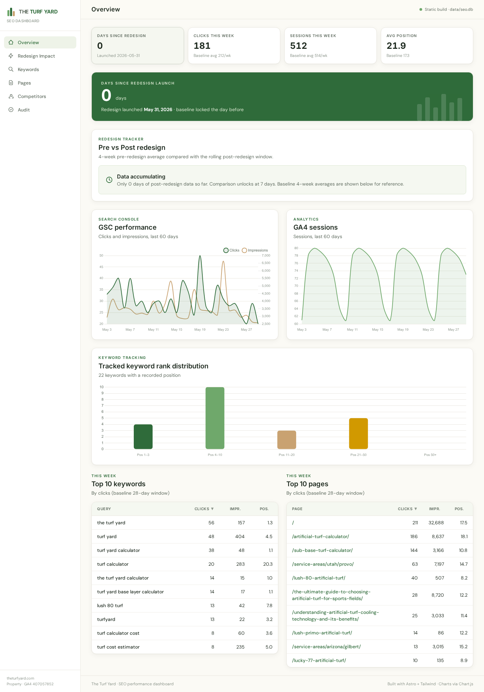

# The Turf Yard — SEO Dashboard

A static, client-facing SEO dashboard for **theturfyard.com**. It tracks Google Search Console performance, GA4 engagement, tracked keyword ranks across 70 terms, competitor positioning, on-page audit findings, and — the centerpiece — the **impact of the site redesign launched on 2026-05-31**.

Built with **Astro 4 (static output) + Tailwind CSS + Chart.js**, backed by a local **SQLite** database. Runs entirely on your Mac; no hosting required.



---

## Architecture

```
Weekly cron (Perplexity Computer, Mon 7am Phoenix)
  ├─ Pulls GSC + GA4 + DataForSEO + Ahrefs
  ├─ Writes snapshot → data/snapshots/{week_start}.json
  ├─ Commits + pushes to GitHub (when repo configured)
  ├─ Emails Daniel: branded PDF + dashboard refresh instructions
  └─ Saves snapshot to memory for next week's WoW deltas

Local Mac
  ├─ git pull           ← pulls fresh snapshot from GitHub
  ├─ npm run weekly     ← imports snapshot → SQLite → rebuilds static site
  └─ npm run dev        ← view at http://localhost:4321
```

The static site can be opened by the client locally (or, optionally, hosted at a private URL via Netlify/Vercel/Cloudflare Pages — see *Hosting options* below).

---

## Quick start

```bash
npm install            # install dependencies (one time)
npm run setup          # initialize + seed SQLite from the locked baseline
npm run dev            # http://localhost:4321
```

For a production build:

```bash
npm run build          # outputs static site to dist/
npm run preview        # serve the built dist/ locally
```

---

## Weekly update flow

Every Monday morning the Computer cron writes a fresh snapshot file. When that lands in your GitHub repo, on your Mac run:

```bash
git pull               # grab this week's snapshot
npm run weekly         # = npm run import:latest && npm run build
npm run preview        # see the updated dashboard
```

Or if you don't yet have the GitHub repo configured, manually copy the snapshot file Computer emails you (or download from `/home/user/workspace/turf_yard_data/snapshots/`) into `data/snapshots/`, then run `npm run weekly`.

---

## Scripts

| Script                  | What it does                                                              |
| ----------------------- | ------------------------------------------------------------------------- |
| `npm run dev`           | Astro dev server with hot reload                                          |
| `npm run build`         | Static production build to `dist/`                                        |
| `npm run preview`       | Serve the built `dist/` locally                                           |
| `npm run db:init`       | Create `data/seo.db` from `db/schema.sql`                                 |
| `npm run db:seed`       | Seed the database from the locked baseline + keyword list                 |
| `npm run setup`         | `db:init` then `db:seed` (run this first after `npm install`)             |
| `npm run import:latest` | Import the most recent JSON snapshot from `data/snapshots/` into SQLite   |
| `npm run weekly`        | `import:latest` then `build` — the standard weekly refresh command        |

---

## Data sources

| Source              | Refresh        | What it powers                                              |
| ------------------- | -------------- | ----------------------------------------------------------- |
| Google Search Console | Weekly       | Clicks, impressions, CTR, position, top queries + pages     |
| Google Analytics 4  | Weekly         | Sessions, users, engagement, traffic sources, landing pages |
| DataForSEO Organic  | Weekly (~$0.07) | Rank tracking for 70 keywords (US + Phoenix-local)         |
| DataForSEO OnPage   | Weekly (~$0.03) | Live audit of top 5 pages: schema, H1, meta, content        |
| DataForSEO Backlinks | Weekly (~$0.02) | Total backlinks, referring domains, new/lost diff          |
| Ahrefs              | Monthly (~150 units) | DR, top competitors — runs after 15th of the month   |

Weekly cost: **~$0.12** in DataForSEO. Ahrefs uses your existing Lite plan budget once per month.

---

## Dashboard pages

| Page              | What it shows                                                                  |
| ----------------- | ------------------------------------------------------------------------------ |
| `/`               | Overview: 4 KPI tiles, redesign banner, GSC + GA4 trends, top keywords + pages |
| `/redesign-impact`| **The client centerpiece.** Pre vs post redesign by metric, trajectory chart   |
| `/keywords`       | All 70 tracked keywords with rank movement, filters by group                   |
| `/pages`          | Per-page GSC + GA4 joined view, top movers cards                               |
| `/competitors`    | DR + organic traffic vs Turf Yard, keyword overlap                             |
| `/audit`          | Active findings grouped by severity, with fix recommendations                  |

---

## Data model

The dashboard reads `data/seo.db` **at build time** via `src/lib/db.ts`. The schema lives in `db/schema.sql`:

- `gsc_daily`, `gsc_query_weekly`, `gsc_page_weekly`
- `ga4_daily`, `ga4_channel_weekly`, `ga4_landing_weekly`
- `keyword_meta` (the 70 tracked keywords + their group/intent/priority)
- `keyword_rank_weekly` (weekly rank pull per keyword per location)
- `competitor_weekly` (Ahrefs DR + traffic, refreshed monthly)
- `audit_findings` (open/fixed/wontfix lifecycle)
- `backlinks_weekly`
- `weekly_summary` (one row per week — headline + JSON blob)

The `seo.db` file is **gitignored** — re-seed from JSON snapshots via `npm run setup` then `npm run import:latest`.

Snapshot JSON shape lives in `scripts/SNAPSHOT_SCHEMA.md`.

---

## Project structure

```
turf_yard_dashboard/
├── astro.config.mjs               # static output, better-sqlite3 external
├── tailwind.config.mjs            # Turf Yard brand palette + fonts
├── package.json
├── db/
│   ├── schema.sql                 # full SQLite schema
│   └── init.ts                    # creates data/seo.db
├── scripts/
│   ├── seed_from_baseline.ts      # one-time baseline seed
│   ├── import_snapshot.ts         # weekly JSON → SQLite importer
│   └── SNAPSHOT_SCHEMA.md         # shape of weekly snapshot files
├── src/
│   ├── components/                # Layout, Logo, KpiCard, charts, DataTable, ...
│   ├── lib/                       # db.ts, dates.ts, formatters.ts, constants.ts
│   ├── pages/                     # index, redesign-impact, keywords, pages, competitors, audit
│   └── styles/global.css
├── baseline/
│   └── baseline_locked_2026-05-30.json   # pre-redesign baseline (do not edit)
├── config/
│   └── tracked_keywords.json      # 70 keywords (edit to change tracking)
└── data/
    ├── seo.db                     # gitignored — regenerate with `npm run setup`
    └── snapshots/                 # weekly JSON snapshots, committed to repo
```

---

## GitHub setup (when you're ready)

The dashboard is designed to live in a **private** GitHub repo that you share with the client as a read-only collaborator. Each week's snapshot becomes a Git commit, giving the client a permanent audit trail.

### One-time setup

```bash
cd "/Users/skillman/Documents/Turf Yard SEO/seo-dashboard"

git init
git add .
git commit -m "Initial dashboard scaffold — baseline locked 2026-05-30"
```

Create a **private** repo on GitHub (suggested name: `theturfyard-seo-dashboard`), then:

```bash
git branch -M main
git remote add origin git@github.com:<your-username>/theturfyard-seo-dashboard.git
git push -u origin main
```

Invite your client as a collaborator (Settings → Collaborators → Add people → role: Read).

### Tell Computer about the repo

Once the repo exists, reply to a Computer email or open a new conversation and say:

> "The Turf Yard dashboard repo is at `github.com/<your-username>/theturfyard-seo-dashboard` — push next week's snapshot there."

Computer will store this in memory and the Monday cron will start committing the snapshot file + `data/seo.db.example` directly to the repo. You'll just `git pull && npm run weekly` on your Mac.

### What the client sees

When you invite the client to the repo:

- The full `dist/` static site (if you commit it) or
- The clean `README.md` with the architecture overview
- Every week's snapshot JSON as a fresh commit they can review
- The `data/snapshots/` directory as the source of truth — a clear timeline of SEO progress post-redesign

For a more polished client experience, optionally enable **GitHub Pages** on the repo (Settings → Pages → Source: GitHub Actions) and add a tiny build workflow that publishes the `dist/` folder to a `gh-pages` branch each commit. Then the client can just bookmark a URL.

---

## Hosting options (optional)

If you want the client to view the dashboard without cloning anything, host the static `dist/` folder for free at any of:

- **Cloudflare Pages** — connect the GitHub repo, build command `npm run weekly`, output `dist`. Free tier covers this.
- **Netlify** — same setup, drag-and-drop or Git-connected.
- **Vercel** — same setup, free Hobby plan.

The dashboard is fully static (no server runtime), so any static host works. Just keep the repo private and use the host's password protection or basic auth if you don't want the dashboard public.

---

## Adding / removing tracked keywords

Edit `config/tracked_keywords.json`. Each keyword needs `keyword`, `group`, `intent`, `priority`. The Monday cron reads this file at run time, so changes take effect on the next refresh.

Cost: ~$0.001 per keyword per week in DataForSEO.

---

## Maintenance notes

- **Baseline is locked** — never edit `baseline/baseline_locked_2026-05-30.json`. The redesign-impact comparisons rely on these exact pre-redesign numbers.
- **The Computer cron is the source of truth for data.** The dashboard never calls APIs directly.
- **Ahrefs refreshes only once per month** (after the 15th — when units reset). Competitors page shows "Last refreshed: {date}" so the client knows.
- **GA4 conversions are zero across the board** — no key events configured. Recommend setting up: `form_submit`, `phone_click`, `quote_request`, `calculator_complete` in GA4 Admin → Events. The dashboard will start showing conversion data automatically once those events fire.

---

## Built by

Daniel @ Elevated Advertising Co. · Phoenix, AZ
Data pipeline + dashboard automation by Perplexity Computer.
